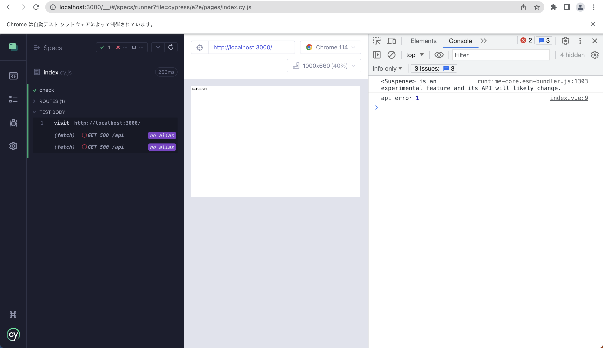
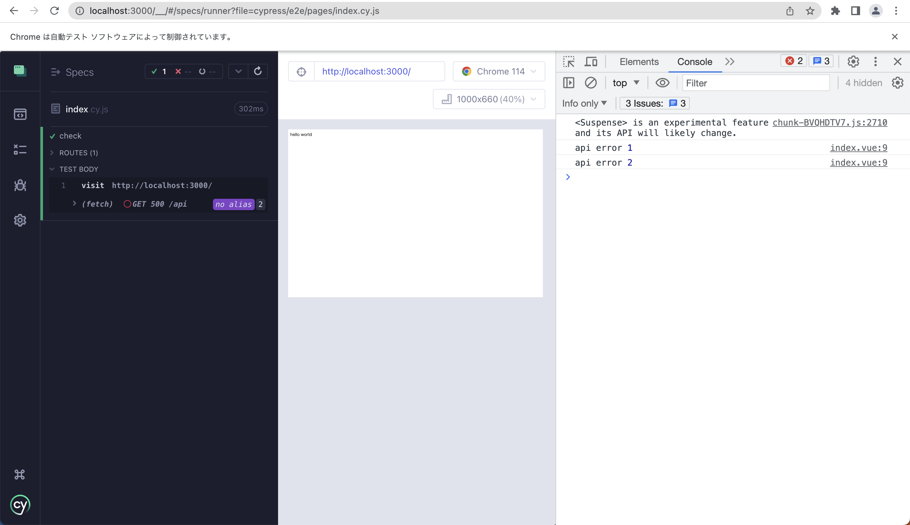

# confirmation-of-usefetch

# check error that returned usefetch
`package.json`
```
"devDependencies": {
  "nuxt": "3.0.0"
  // "nuxt": "3.6.2"
},
```
```
npm i
npm run dev

# other terminal
npm run cypress
```

# Screen shots

